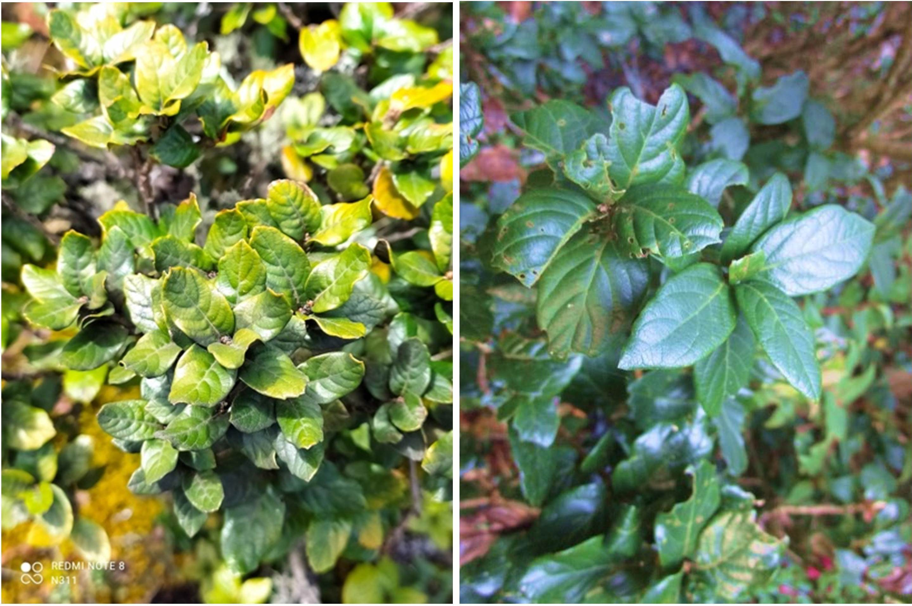

#### Introducción

##### *Quercus macdougallii,* es un encino endémico de la Sierra norte de Oaxaca. Debido a la pérdida y fragmentación de su hábitat Q. macdougallii se encuentra dentro de la categoría de amenazada (EN), en la Lista Roja de Especies Amenazadas de la Unión Internacional para la Conservación de la Naturaleza [UICN] (Carrero *et al.*, 2020).

##### Además, la especie tiene un historial de perturbaciones antropogénicas significativas en las últimas décadas, incluyendo la extracción de individuos y los incendios forestales en la región de Santiago Comaltepec, que ocurrieron en sus poblaciones en 1982 y 1998, respectivamente. Aunado a esto se ha observado una baja producción de bellotas en los últimos 5 a 10 años (Alfonso-Corrado *et al.*, 2024).

##### Debido a lo anterior, es importante de establecer estrategias locales para su conservación y restauración in situ. Un aspecto importante a destacar es la necesidad de comprender a fondo diversos aspectos biológicos de la especie, como su distribución geográfica, vulnerabilidad a los cambios antropogénicos y efectos del cambio climatico.



#### Área de estudio

##### El área de estudio se encuentra ubicada en la Sierra Juárez, de Oaxaca, México , dentro del sistema montañoso de la Sierra Madre de Oaxaca, de manera particular en la vertiente Cerro Zacate- Humo Grande. El área de distribución de Q. macdugallii pertenece a los municipios de Santiago Comaltepec e Ixtlán de Juárez. El clima del área de estudio es templado húmedo con lluvias en verano, con una precipitación media anual de 1600 mm y una temperatura media anual de 14 °C (Anacleto-Carmona, 2015).


#### Pregunta de Investigación

##### ¿Existen diferencias en la expresión de los Caracteres morfológicos de Q. macdougallii influenciadas por variables ambientales entre dos sitios de su distribución natural?

#### Base de Datos

##### La base de datos es parte de un proyecto en desarrollo de Alfonso-Corrado et al.(en prensa), que tiene por objetivo conocer la distribución y estructura poblacional de Q. macdougalli, encino endémico de Oaxaca. Tiene 210 observaciones y 10 variables, como son DAP, Altura, diámetro de copa y coordenadas. Las variables fueron obtenidas entre el 29 de febrero y 6 de septiembre del 2024.

#### Análisis de variables morfológicas y ambientales de Q. macdougallii

#### 1. Cargar paquetes necesarios

```{r }
# Cargar paquetes necesarios 
# Vector de paquetes necesarios
paquetes <- c( ",tidyverse", # manipulación de datos
               "ggplot2",    # Visualización de datos
               "geodata",    # descargar datos climáticos 
               "terra",      # Extraer valores de variables ambientales descargados para coordenadas especificadas
               "factoextra", # Extraer y visualizar los resultados de análisis de datos multivariados
               "ggcorrplot", # Visualizar  matrices de correlación utilizando ggplot2
               "devtools",     # 
               "ggbiplot",   # grafica de PCA
               "car",        # funciones y herramientas para el análisis de regresión
               "psych",      # PCA
               "patchwork")  # Une gráficas

# Instalar paquetes si no están instalados
#install.packages(paquetes, dependencies = TRUE)
#----------------
#paquetes necesarios 
library(tidyverse)
library(ggplot2)
library(geodata)
library(terra)
library(factoextra)
library(ggcorrplot)
library(devtools)
library(ggbiplot)
library(car)
library(psych)
library(patchwork)
```

#### 2. importar las variables de Q. macdougalli y explorar la base de datos

```{r, warning=FALSE, message=FALSE}
df <- read_csv(file = "dataframe_Quercusm.csv") 
dim(df)
summary(df)
```

##### Eliminar filas con valores faltantes

```{r}
df_filt <- na.omit(df)
dim(df_filt)
summary(df_filt)
```

##### Agregar una nueva variable y convertir a factor una variable de carácteres

```{r}
# Agregar una nueva variable que contenga el promedio del diametro de copa
df_filt$diametro_copa_mm <- (df_filt$diametro_copa1_m +df_filt$diametro_copa2_m)/2
#convertir a factor la variable lugar
class(df_filt$lugar)
df_filt$lugar <- as.factor(df_filt$lugar)         
class(df_filt$lugar)
summary(df_filt$lugar)
```

#### 3. Calcular la media y desviación estandar por lugar

##### calcular logaritmo de las variables para normalizar y estabilizar varianza

```{r  warning=FALSE, message=FALSE}
df_filt$H_log <-log(df_filt$Altura_m) 
df_filt$D_log <-log(df_filt$Diametro_cm)
df_filt$C_log <-log(df_filt$diametro_copa_mm)
```

##### \# La función aggregate() se utiliza para calcular estadísticas de resumen para subconjuntos de datos. Permite agrupar datos según una o más variables y aplicar una función específica

```{r warning=FALSE}
aggregate(cbind(H_log, D_log, C_log) ~ lugar, data=df_filt, FUN=function(x) c(mean=mean(x), sd=sd(x)))
```

#### 4. graficar las variables por lugar

```{r, warning=FALSE, message=FALSE}
# establecer paleta de colores
pal <- c('#8B3A62', '#7CCD7C')
#Gráfico de Altura
H <- ggplot(df_filt, aes(x=lugar, y=H_log, fill = lugar)) +
  geom_boxplot() +
  geom_jitter(width=0.15) + # permite vizualizar los puntos de datos individuales
  scale_fill_manual(values=pal)+
  labs(title = "Altura",
x = "Lugar", # Etiqueta del eje X
y = "Log de Altura") # Etiqueta del eje Y
H
```

####Gráfico de DAP

```{r}
D <- ggplot(df_filt, aes(x=lugar, y=D_log, fill = lugar)) + 
  geom_boxplot() + 
  geom_jitter(width=0.15)+ # permite vizualizar los puntos de datos individuales
  scale_fill_manual(values=pal)+ 
  labs(title = "Diámetro a altura del pecho",
       x = "Lugar", # Etiqueta del eje X
       y = "Log de DAP") # Etiqueta del eje Y
D
```

####Gráfico de Diámetro de copa

```{r}
Cr <- ggplot(df_filt, aes(x=lugar, y=C_log, fill = lugar)) +
  geom_boxplot() +
  geom_jitter(width=0.15)+ # permite vizualizar los puntos de datos individuales
  scale_fill_manual(values=pal)+
  labs(title = "Diámetro de copa",
       x = "Lugar", # Etiqueta del eje X
       y = "Log de Diámetro de copa") # Etiqueta del eje Y
Cr
```

#### unir las gráficas con patchwork

##### Aplicar un tema común a todos los gráficos y titulos globales al gráfico

```{r, warning=FALSE, message=FALSE}
var <- wrap_plots((H /D) | Cr) &
  plot_annotation(
    title = "Variables morfológicas de Q. macdougallii ",
    subtitle = "Datos de distribución y estructura poblacional de Q. macdougallii",
    caption = "Fuente: Alfonso-Corrado etal, en prensa") &
  theme_bw()
var
```

```{r}
# Guardar gráfico
ggsave ("Gráfico_variables.png", plot = var, width = 12, height = 6)
```

#### 5. Gráfica de dispersión para explorar la relación entre variables morfológicas

##### Gráfica de relación entre DAP y altura

```{r, warning=FALSE, message=FALSE}
D_H <- ggplot(df_filt, aes(x = D_log, y = H_log)) +
  geom_point() +
  geom_smooth(method = "lm", se = TRUE, color = "#458B74")+
  labs(title = "Relación entre Diámetro a altura del pecho y Altura",
      x = "Log DAP", # Etiqueta del eje X
      y = "Log Altura") + # Etiqueta del eje Y
theme_bw()+
  facet_wrap(~ lugar)
  D_H
```

##### Gráfica de relación entre DAP y Diámetro de Copa

```{r, warning=FALSE, message=FALSE}
D_C <- ggplot(df_filt, aes(x = D_log, y = C_log)) +
  geom_point() +
  geom_smooth(method = "lm", se = TRUE, color = "#8B3E2F")+
  labs(title = "Relación entre Diámetro a altura del pecho y Diámetro de Copa",
       x = "Log DAP", # Etiqueta del eje X
       y = "Log de Diámetro de copa ") + # Etiqueta del eje Y
  theme_bw()+
  facet_wrap(~ lugar)
D_C
```

##### Unir los gráficos

```{r warning=FALSE, message=FALSE}
dispersion <- (D_H /D_C) + # unir verticalmente 
  plot_annotation(
    title = "Relación entre Variables morfológicas de Q. macdougallii ",
    subtitle = "Datos de distribución y estructura poblacional de Q. macdougallii",
    caption = "Fuente: Alfonso-Corrado etal, en prensa") 

dispersion
```

```{r}
## Guardar gráfico 
ggsave ("Gráfico_dispersión.png", plot = dispersion, width = 8, height = 6)
```

#### 6. Importar Variables Ambientales

```{r warning=FALSE, message=FALSE}
# importar el dataframe con las variables climáticas 
df_bio <- read_csv(file = "bio_coor.csv") 
# importar datos de elevacion 
alt <- read_csv("elevacion.csv")
# unir el data frame de las variables climáticas con la elevación 
df_env <- left_join(df_bio, alt, by="ID")
```

#### 7. Análisis estadísticos

##### 7.1 Prueba de levene

##### La prueba de Levene es un análisis estadístico que evalúa si las varianzas de dos o más grupos son iguales

##### Si el p-valor es menor que el nivel de significancia (generalmente 0.05), indica que las varianzas son diferentes

```{r}
# Prueba de levene para log de Altura
leve_res_H <- leveneTest(H_log ~ lugar, data = df_filt)
print(leve_res_H)
# Prueba de levene para log de Diámetro a altura del pecho
leve_res_D <- leveneTest(D_log ~ lugar, data = df_filt)
print(leve_res_D)
# Prueba de levene para log de Diámetro de Copa
leve_res_C <- leveneTest(C_log ~ lugar, data = df_filt)
print(leve_res_C)
```

##### El valor de p es menor al nivel de significancia, lo cual indica un resultado estadísticamente significativo, lo que significa que se rechaza la hipótesis nula de varianzas iguales. Las varianzas se consideran desiguales entre los sitios

##### 7.2 Prueba de t de Welch

##### La prueba t de Welch es una prueba estadística que se utiliza para comparar la media de dos grupos en situaciones donde los tamaños de muestra y/o las varianzas no son iguales.

```{r}
# Prueba t de Welch  para log de Altura
t_H <- t.test(H_log ~ lugar, data = df_filt, var.equal = FALSE)
print(t_H)
# Prueba t de Welch  para log de Diámetro a altura de copa
t_D <- t.test(D_log ~ lugar, data = df_filt, var.equal = FALSE)
print(t_D)
# Prueba t de Welch  para log de Diámetro de Copa
t_C <- t.test(C_log ~ lugar, data = df_filt, var.equal = FALSE)
print(t_C)
```

##### Dado que p-valor es menor que el nivel de significancia, se rechaza la hipótesis nula de medias iguales

#### 8. Análisis de Multivariado

##### 8.1 Análisis de correlación de las variables climáticas, para seleccionar las variables para el PCA

##### La gráfica de la mátriz de correlación permite observar, los valores de crorrelación entre variables, lo cual permite decidir que variables utilixar en análisis posteriores, por lo general se trata de evitar seleccionar variables con alta correlación.

```{r}
mat_cor <- cor(subset(df_env, select = -c(ID)))
# Gráficar mátriz de correlación 
ggcorrplot(mat_cor, #matriz de correlación
           hc.order = FALSE, #si se ordena por un método (HCLUST) o por default
           type = "lower", #si se muestra toda o una secci?n
           lab = TRUE, #si se agregan los d?gitos
           lab_size = 3, #tama?o de los d?gitos
           colors= c("blue", "white", "red") #vector de colores
)
```

##### seleccionar las viarables bio_01 (temperatura media anual), bio_12 (precipitación anual) y elevación

```{r warning=FALSE, message=FALSE}
# unir dataframes con varibles morfológicas y ambientales 
df_all <- left_join(df_env, df_filt, by=join_by("ID"=="Id"))
# seleccionar variables para el PCA 
var_pca <- dplyr::select (df_all,bio_01,bio_12,elevacion, H_log, D_log, C_log, lugar)
```

#### 8.2 Análisis de correlación de las variables

```{r}
mat_cor_var <- cor(var_pca [,-7])

# Gráficar mátriz de correlación 
cm <- ggcorrplot(mat_cor_var, #matriz de correlaci?n
           hc.order = FALSE, #si se ordena por un m?todo (HCLUST) o por default
           type = "lower", #si se muestra toda o una secci?n
           lab = TRUE, #si se agregan los d?gitos
           lab_size = 3, #tama?o de los d?gitos
           colors= c("blue", "white", "red") #vector de colores
)
# Agregar titulos 
cmt <- cm + labs(title = "Mátriz de Correlación de Variables morfológicas y ambientales de Q. macdougallii",
          subtitle = "Datos de distribución y estructura poblacional de Q. macdougallii",
          caption = "Fuente: Alfonso-Corrado etal, en prensa")
cmt
```

##### Se observa una fuerte correlación entre las variables morfológicas

#### 8.3 Análisis de Componentes Principales

##### El PCA reduce la dimensionalidad de los datos al crear nuevas variables, llamadas componentes principales, que son combinaciones lineales de las variables originales. Su objetivo es simplificar conjuntos de datos grandes manteniendo la mayor parte de la información (varianza) posible.

##### Facilita la visualización de datos de alta dimensionalidad en un gráfico de 2 o 3 dimensiones

```{r warning=FALSE, message=FALSE}
# Calculo del PCA
        pc <- prcomp(var_pca[,-7],
             center = TRUE,
             scale. = TRUE)
attributes(pc)
print(pc)
summary(pc)
```

##### crear un dataframe con los valores del summary(pc), que se usaran para graficar la varianza explicada

```{r warning=FALSE, message=FALSE}
pca_summary <- data.frame(
  Components = c("1", "2", "3", "4", "5","6"),
  ExplainedVariance= c(46.25, 32.77, 16.01, 03.60, 01.373, 00.0010),
  CumulativeExplainedVariance = c(46.25, 79.02, 95.03, 98.63, 99.999, 100.0000))
```

##### Gráfica de la varianza explicada

```{r warning=FALSE, message=FALSE}
plot_explained_variance <- ggplot(pca_summary, aes(x = Components)) +
  geom_bar(aes(y = ExplainedVariance), stat = "identity", fill = "steelblue", color = "black") +
  geom_text(aes(y = ExplainedVariance, label = paste0(round(ExplainedVariance, 2), "%")), vjust = -0.5, size = 5, color = "black") +
  ylim(0, 101) +
  labs(
    title = "Varianza explicada por Componente Principal",
    x = "Componente Principal",
    y = "Porcentaje de Varianza Explicada"
  ) +
  theme_minimal()
plot_explained_variance 
```

##### Gráfica de la Varianza explicada acumulada

```{r warning=FALSE, message=FALSE}
plot_cumulative_explained_variance <- ggplot(pca_summary, aes(x = Components)) +
  geom_line(aes(y = CumulativeExplainedVariance), color = "orange", group = 1) +
  geom_point(aes(y = CumulativeExplainedVariance), color = "orange") +
  geom_text(aes(y = CumulativeExplainedVariance, label = paste0(round(CumulativeExplainedVariance, 2), "%")), vjust = -0.5, size = 5, color = "#000000", nudge_x = 0.15) +
  scale_y_continuous(name = "Varianza explicada acumulada (%)") +
  ylim(0, 101) + # limite en y del gráfico
  labs(
    title = "Varianza explicada acumulada",
    x = "Componente Principal"
  ) +
  theme_minimal()
plot_cumulative_explained_variance

```

##### Unir los gráficos de varianza explicada

```{r warning=FALSE, message=FALSE}
var_exp <-  (plot_explained_variance +plot_cumulative_explained_variance)+
  plot_annotation(
    title = "Varianza Explicada (PCA)",
    subtitle = "Datos de distribución y estructura poblacional de Q. macdougallii",
    caption = "Fuente: Alfonso-Corrado etal, en prensa"
)
var_exp
```

```{r}
### guardar grafico de varianza explicada
ggsave ("Varianza Explicada.png", plot = var_exp, width = 8, height = 6)
```

##### Gráfico PCA

```{r}
# guardar en un vector los datos de sitio
y <- var_pca %>% select(lugar)

#guardar en un vector los 2 primeros vectores
componentes <- data.frame(pc$x[, 1:2], sitio = y)
colors <- c("#38812F", "#A30000")

plot_pca <- ggplot(componentes, aes(x = PC1, y = PC2, color = lugar)) +
  geom_point(alpha = 0.8, size = 4) +
  labs(title = "Variables morfológicas y ambientales de Q. macdougallii proyectadas en los primeros 2 Componentes Principales",
       subtitle = "Datos de distribución y estructura poblacional de Q. macdougallii",
       caption = "Fuente: Alfonso-Corrado etal, en prensa") +
  scale_color_manual(values = colors) +
  theme_minimal()
plot_pca
```

```{r}
## guardar gráfico de PCA
ggsave ("PCA.png", plot = plot_pca, width = 8, height = 6)
```

##### Gráfico de PCA con ejes de variables

```{r warning=FALSE, message=FALSE}
g <- ggbiplot(pc,
              obs.scale = 1,
              var.scale = 1,
              groups = var_pca$lugar,
              ellipse = TRUE,
              circle = TRUE,
              ellipse.prob = 0.68)
g <- g + scale_color_discrete(name = '')
g <- g + theme(legend.direction = 'horizontal',
               legend.position = 'top')
g <- g + plot_annotation(
  title = "Análisis de Componenetes Principales (PCA)",
  subtitle = "Datos de distribución y estructura poblacional de Q. macdougallii",
  caption = "Fuente: Alfonso-Corrado etal, en prensa"
)
g
## guardar gráfico de PCA
ggsave ("PCA_2.png", plot = g, width = 6, height = 8)

```
#### Conclusiones 
##### •	El análisis de t de welch sugiere que existen diferencias entre las tres variables morfológicas por sitios  
##### •	Las gráficas de PCA muestran cierta separación entre individuos por sitios, sin embargo, se observa una alta correlación entre las variables morfológicas. Por tanto, se sugiere que en futuros análisis se explore la relación de otras variables morfológicas (ej. Morfología de la hoja) con variables ambientales. 
